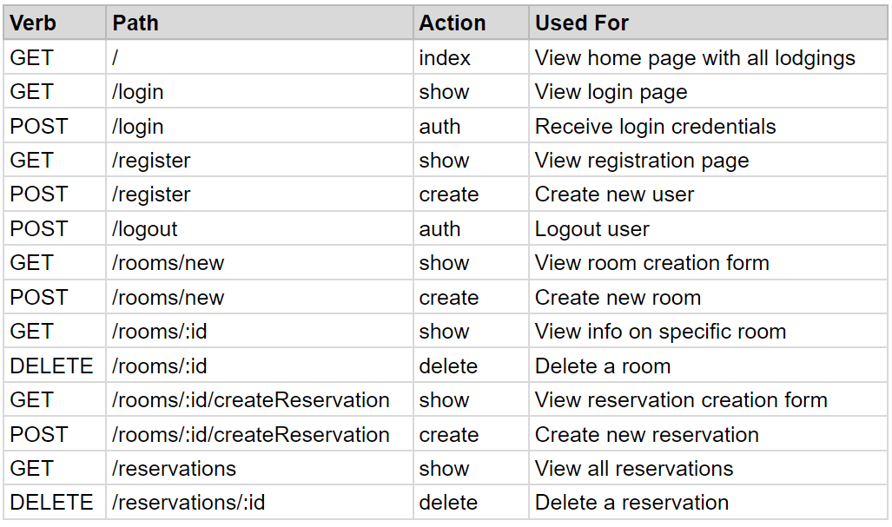

# MySQLMiniAirbnb

A hands-on project to get a taste of MySQL.

<h2>Features:</h2>

MiniAirbnb is a simple full-stack CRUD app using Node, Express, EJS, and MySQL. Users must register and authenticate before being able to interact with the site.
Registration is handled with bcrypt meaning that passwords stored in the MySQL database are salted and hashed. Once authenticated, users can view available lodgings, create new lodgings, and make reservations for lodgings that aren't their own. Likewise, users can delete their own reservations and lodgings. 

<h2>Database Design: <a href="https://drawsql.app/mysqlhobby/diagrams/miniairbnb#">(Database Schema)</a></h2>

Data is split into their smallest normal forms. These normal forms (or tables) consist are categorized as users, rooms, and reservations. See the link above for the general overview and the code below for more details on what each table contains. For every table, the primary key is the id though the user table demands that emails are unique. Every room has exactly one owner though a user can own many rooms. Likewise, a user can own many reservations but each reservation corresponds to exactly one room. When a room is deleted, the reservations corresponding to said room are deleted as well with `ON DELETE CASCADE`

<h3>Users Table</h3>

```
CREATE TABLE users(
    id BIGINT UNSIGNED NOT NULL AUTO_INCREMENT,
    first_name VARCHAR(40) NOT NULL,
    last_name VARCHAR(40) NOT NULL,
    email VARCHAR(60) NOT NULL,
    hashed_password CHAR(60) NOT NULL,
    PRIMARY KEY (id),
    UNIQUE(email)
);
```

<h3>Rooms Table</h3>

```
CREATE TABLE rooms(
    id BIGINT UNSIGNED NOT NULL AUTO_INCREMENT,
    total_occupancy INT NOT NULL,
    total_beds INT NOT NULL,
    total_bathrooms INT NOT NULL,
    name VARCHAR(255) NOT NULL,
    summary VARCHAR(255) NOT NULL,
    address VARCHAR(255) NOT NULL,
    owner_id BIGINT UNSIGNED NOT NULL,
    PRIMARY KEY (id)
);
```

<h3>Reservations Table</h3>

```
CREATE TABLE reservations(
    id BIGINT UNSIGNED NOT NULL AUTO_INCREMENT,
    date DATE NOT NULL,
    user_id BIGINT UNSIGNED NOT NULL,
    room_id BIGINT UNSIGNED NOT NULL,
    PRIMARY KEY (id),
    FOREIGN KEY (room_id) REFERENCES rooms(id) ON DELETE CASCADE
);
```

<h2>Avoiding SQL Injection</h2>

Initially, I made a huge mistake by including user input directly into template string SQL queries that would be sent directly to the the database. 
I was aware of SQL injections before but did not realize how vulnerable my application to such an attack if I used this method. After researching some examples of SQL injection and learning some SQL best practices,
I refactored the code so that SQL queries would be parameterized before being sent to the database. This way, the MySQL server can differentiate
between user input and the actual query before executing the query sent.

<h2>Server Routes</h2>


